# AmazingHand Controller – User Manual

> **Version:** 2026-03-21  
> **Applies to:** `amazing_hand_gui.py` (Desktop GUI)

---

## 1. Introduction

The AmazingHand Controller GUI provides real-time monitoring and manual control for an eight-servo robotic hand powered by Feetech SCS0009 actuators. The interface is divided into panels for finger control, global management, telemetry visualization, and activity logging. This guide walks you through installation, navigation, and common workflows.

> **Tip:** Keep this manual open while operating the GUI. Tooltips embedded in the application reiterate the same descriptions when you hover over controls.

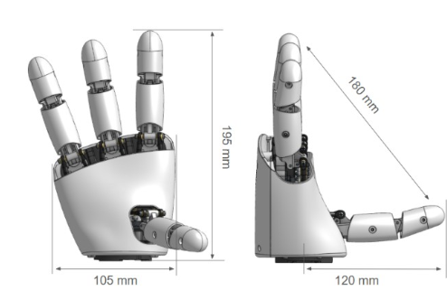

---

## 2. Quick Start Checklist

1. **Install dependencies** (one-time per environment):
   ```bash
   python -m pip install -r requirements.txt
   ```
2. **Power the hardware:** connect the 5 V supply to the servo chain and plug in the USB serial adapter.
3. **Launch the GUI:**
   ```bash
   python amazing_hand_gui.py
   ```
4. **Connect to the controller:** choose the serial **Port** (e.g., `COM9`) and click **▶ Connect**.
5. **Verify telemetry:** look for live updates in the chart and feedback table.

---

## 3. Screen Overview

```
+--------------------------------------------------------------------------------+
|                              AmazingHand Controller                            |
+---------------------------+-----------------------------------------------+----+
| Finger Controls           | Chart Controls & Telemetry Plot                    |
| (Ring – Middle – Pointer) | (Display menu, chart canvas)                       |
+---------------------------+-----------------------------------------------+----+
| Control Stack             | Thumb finger   | Feedback Table (Servo Metrics)    |
| (Connection, Global, Pose,| control        | (Goal, Position, Load, etc.)      |
|  Sequence)                |                |                                   |
+---------------------------+                                                    |
| Execution Log & Status    |                                                    |
+--------------------------------------------------------------------------------+
```

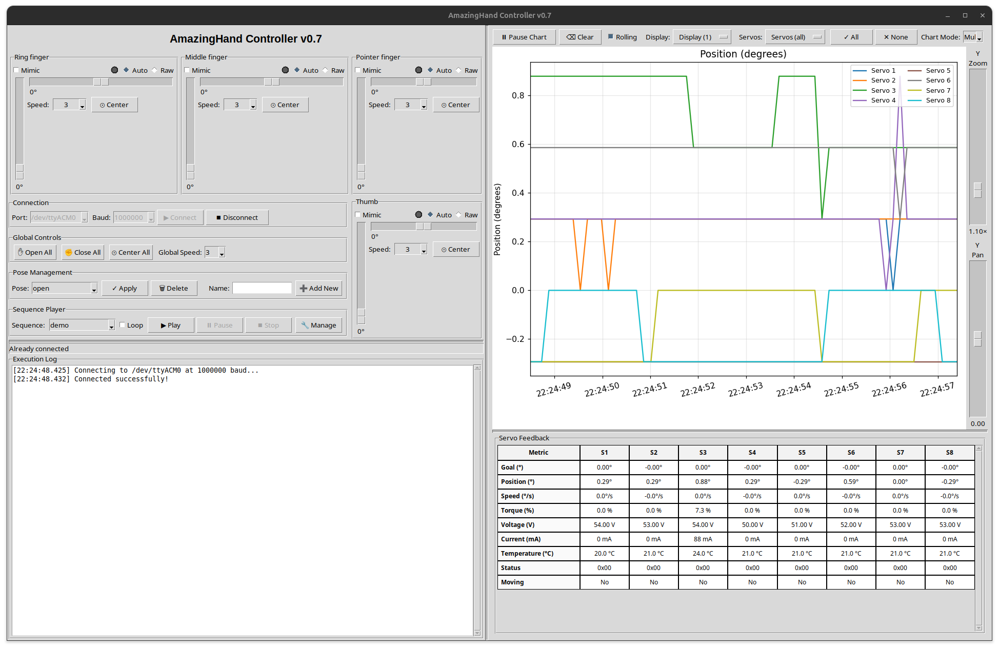

### 3.1 Panels at a Glance

| Panel | Location | Purpose |
|-------|----------|---------|
| **Finger Controls** | Left, top (3 fingers) + bottom-right (Thumb) | Individual sliders and speed selectors for each finger pair. Includes mimic indicators and per-finger status LEDs. |
| **Right Control Stack** | Left, bottom-right | Connection settings, global controls, pose management, and sequence player. |
| **Telemetry Panel** | Right | Real-time charts with zoom/pan sliders and a configurable feedback table. |
| **Execution Log** | Bottom | Stream of status messages, warnings, and sequence progress. |

---

## 4. Detailed Panel Guide

### 4.1 Finger Control Panel (Left Column)

Each finger widget controls a pair of servos (position + side offset):

- **Mode toggle:** switch between **Auto** (base + offset sliders) and **Raw** (direct servo targets).
- **Status LED:** gray (idle), green (moving), red (blocked potential, based on load vs goal).
- **Position slider:** 0–110° (open to closed). Mouse wheel adjusts by 1°; dragging snaps quickly.
- **Side slider:** ±40° for lateral adjustments. The Thumb side slider is **inverted** so that the physical direction matches the hand's anatomical orientation — dragging right moves the thumb in the positive direction relative to its hardware mounting.
- **Speed selector:** dropdown 1–6 controlling movement velocity for both servos in the finger pair.
- **Mimic checkbox:** mirrors close/open motions from a source finger for coordinated movement while in Auto mode.

**Finger Modes: Auto vs Raw**

- **Auto mode** (default) exposes the close/open slider, lateral offset slider, speed dropdown, and center button. The GUI blends those two slider values into servo commands using the calibrated extremes stored in `data/hand_config.yaml`, so the pair tracks natural finger poses without manual servo math. Mimic stays active here—enable it on multiple fingers to drive them in sync with whichever finger you are currently adjusting.
- **Raw mode** swaps the Auto controls for two vertical sliders labeled by servo. Move them to command the underlying servo angles directly when testing end-stops, validating calibration, or diagnosing linkage issues. The center button and mimic checkbox are disabled because Raw bypasses the auto-mixing logic; keyboard shortcuts still work, with Up/Down driving servo 1 and Left/Right driving servo 2. Raw uses the last-selected speed value, so set speeds before switching if you need a specific motion rate.

**How Auto mode computes servo targets**

- The close/open slider value is clamped to `limits.base_min/base_max`, then normalized (`t = base / base_max`) to interpolate between the `auto_extremes` open vs closed poses for each side of the finger.
- The side offset slider is clamped to `limits.side_min/side_max` and turned into a blend factor (`u`). Negative offsets lerp from the center pose toward `left_open`/`left_closed`; positive offsets lerp toward the right-side extremes.
- With no lateral offset, both servos simply receive the base slider value. Final servo targets are clamped to `limits.servo_min/servo_max` before being issued, keeping motions within calibrated safe bounds.

Keyboard shortcuts supplement the sliders (documented in §5.2).

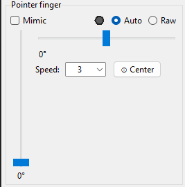

### 4.2 Global Control Stack (Right of Finger Panel)

1. **Connection:** port and baudrate selection (both dropdowns are disabled while connected), connect/disconnect buttons. Status bar at the bottom reports success or errors.
2. **Global Controls:**
   - **Open All / Close All / Center All** – apply to every finger instantly.
   - **Global Speed dropdown** – sets the per-finger speed selectors to a common value (1–6).
3. **Pose Management:** save, load, apply, and delete stored poses from `data/hand_config.yaml`.
   - Layout: `Pose: [dropdown]  ✓ Apply  🗑 Delete  Name: [entry]  ➕ Add New`
   - **🗑 Delete** removes the selected pose permanently (confirmation dialog shown).
4. **Sequence Player:** select and execute multi-step animations, with optional looping. Access the sequence manager dialog via **🔧 Manage**.

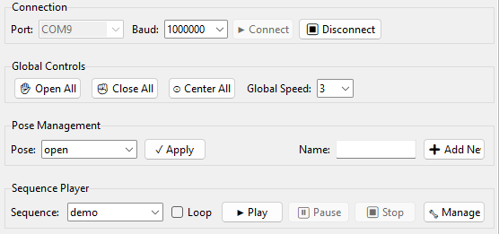

### 4.3 Telemetry & Feedback Panel (Right Column)

- **Controls row:**
  - Pause/resume chart updates.
  - Rolling window toggle.
  - Metric selection (position, load, speed, temperature, voltage, moving flag).
  - Mode switch (Multi-Servo vs Scope) with servo selector for the latter.
  - Servo visibility dropdown with “All/None/Clear” helpers.
  


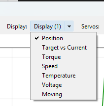

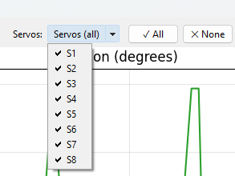

#### Chart Modes

- **Multi-Servo** (default) keeps every enabled servo trace on the chart. Use the **Servos** dropdown to quickly toggle groups on/off and compare motion or load across fingers.
- **Scope** activates the **Scope Servo** selector, letting you focus on a single channel while still using the same metric checkboxes. Combine this mode with the servo visibility menu (e.g., hide all, then re-enable the scope servo) to obtain an oscilloscope-style view without other traces.
- Regardless of mode, the telemetry table keeps presenting all servos so you can correlate the focused chart with the wider data snapshot.
- **Chart area:** Matplotlib plot showing selected telemetry. Zoom via sliders:
  - **Y Zoom / Pan:** vertical scaling and shifting.
  - **Time Zoom / Pan:** focus on recent history or older samples.
- **Feedback table:** scrollable grid summarizing Goal, Position, Speed, Load, Voltage, Temperature, Status, and Moving flags for each servo.

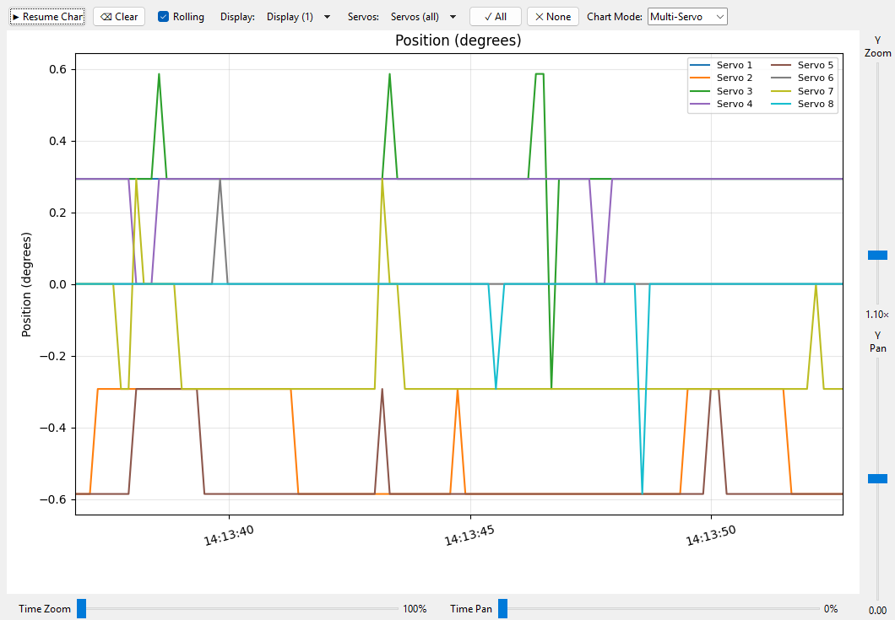

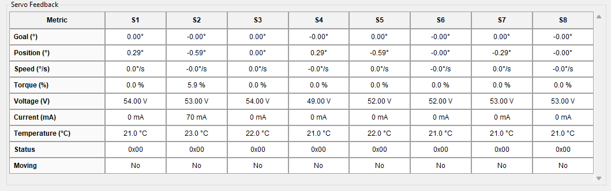

### 4.4 Execution Log & Status Bar

Located below the finger panel, the log records operations in chronological order. The status bar displays the latest action or warning.

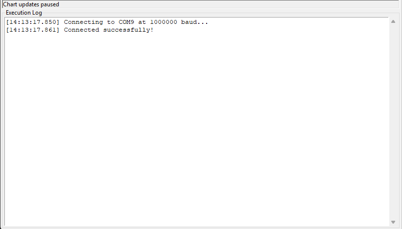

---

## 5. Operating the Hand

### 5.1 Connecting to Hardware

1. Power the servos and connect the USB adapter.
2. Launch the GUI and confirm the correct **Port** auto-selects (`COM*` on Windows or `/dev/tty*` on Linux/macOS).
3. Click **▶ Connect**. Success changes the button states and updates the status bar.
4. If connection fails, check cabling, power, and port assignment.

### 5.2 Manual Control and Shortcuts

- Select a finger with keys **1–4** (1 = Ring, 2 = Middle, 3 = Pointer, 4 = Thumb).
- **Arrow keys:** Up/Down adjust the position; Left/Right adjust lateral offset.
- Holding **Shift** multiplies step size by 5; **Ctrl** multiplies by 10.
- **Q / E:** fully close / open the selected finger.
- **C:** center lateral offset.
- The on-screen sliders mirror the keyboard input in real time.

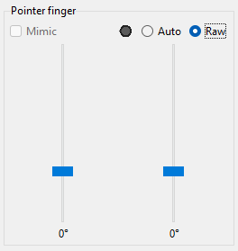

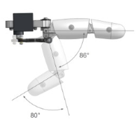

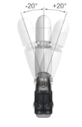

### 5.3 Setting Speeds

- Per-finger speed dropdown (1 = slow, 6 = fast) controls servo velocity.
- The **Global Speed** selector synchronizes all finger speeds.
- Observe speed changes in the feedback table (`Speed` row) during motion.

### 5.4 Applying and Deleting Poses

1. Arrange finger positions using sliders or keyboard shortcuts.
2. In **Pose Management**, type a unique name and click **➕ Add New**.
3. To apply, select the pose from the dropdown and click **✓ Apply**.
4. To delete, select the pose from the dropdown and click **🗑 Delete**. A confirmation dialog prevents accidental removal.

> Poses store servo positions only; speeds are determined at runtime by the GUI settings.

### 5.5 Building and Executing Sequences

1. Click **🔧 Manage** in the Sequence Player.
2. In the dialog:
   - Use the **Available Poses** list to add steps (double-click or press **➕ Add**).
   - Adjust per-finger speeds via spinboxes, and set optional step delays.
   - Insert dedicated sleep intervals using **⏱ Delay**.
   - Reorder steps with ↑/↓ buttons.
   - Enter a name and click **💾 Save Sequence**.
   - Click **▶ Execute** to test without saving.
3. Back in the main window, select the sequence and press **▶ Play**. Enable **Loop** for continuous playback.

> Sequence definitions live in `data/hand_config.yaml` under the `sequences` key. Loops are controlled runtime-side, not in YAML.

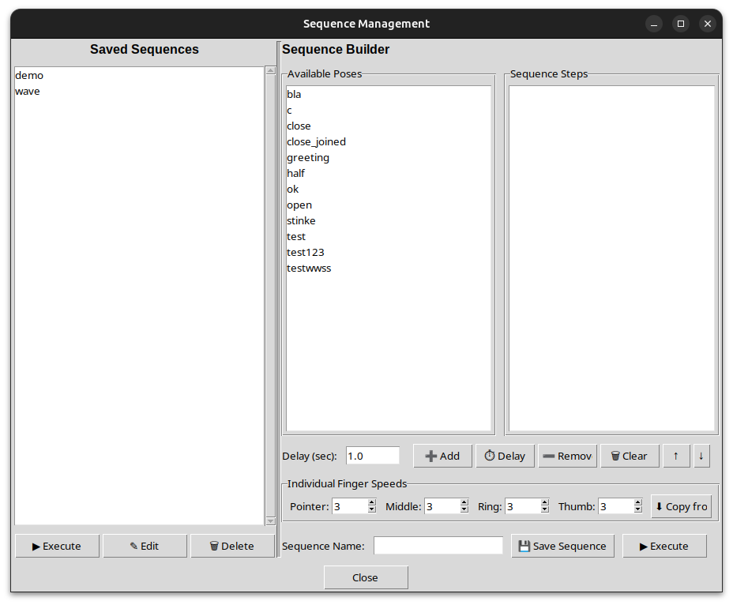

### 5.6 Monitoring Telemetry

- Ensure desired metrics are checked in the **Display** menu.
- Use the zoom/pan sliders to focus on segments of interest.
- Hover over chart elements (Matplotlib standard interactions) to inspect values.
- The feedback table updates asynchronously; highlighted cells indicate recent changes.
- If the chart becomes busy, click **⌫ Clear** to reset collected data.

---

## 6. Troubleshooting

| Symptom | Suggested Action |
|---------|-----------------| 
| **No serial ports listed** | Replug the USB adapter, install drivers, or restart the GUI. |
| **Connect button greyed out** | Already connected; click **⏹ Disconnect** first. |
| **Sluggish UI during resizing** | Performance optimizations (debounced resize, throttled redraws) minimize this, but closing unnecessary windows can help. |
| **Sequence does not move all fingers** | Check per-step speeds and ensure each pose contains all eight servo values. |
| **Blocked indicator persists** | Inspect mechanical obstructions; blocked status is triggered when goal and position differ significantly without movement. |

---

## 7. Command-Line Companion (`amazing_hand_cmd.py`)

For scripted operations, refer to the CLI section in `README.md`. The GUI and CLI share the same configuration file (`data/hand_config.yaml`).

---

## 8. Appendix

### 8.1 File Structure

```
AmazingHandGUI/
├── amazing_hand_gui.py          # GUI application
├── amazing_hand_cmd.py          # CLI tool
├── data/hand_config.yaml        # Poses & sequences
├── docs/user_manual.md          # This document
├── docs/screenshots/            # PNG captures embedded in this manual
├── docs/scs_servo_protocol.md   # SCS servo protocol reference
├── PERFORMANCE_OPTIMIZATIONS.md # Rendering improvements
└── README.md                    # Quick reference
```

### 8.2 Useful Links

- [AmazingHand (official project)](https://github.com/pollen-robotics/AmazingHand)
- [Feetech Servo Debug Tool](https://github.com/Robot-Maker-SAS/FeetechServo/tree/main/feetech%20debug%20tool%20master/FD1.9.8.2)
- [Servo identification tutorial](https://www.robot-maker.com/forum/tutorials/article/168-brancher-et-controler-le-servomoteur-feetech-sts3032-360/)

---

## 9. Revision History

| Date | Author | Notes |
|------|--------|-------|
| 2026-03-21 | Ingo | Panel layout update: Ring/Pointer swap, Thumb moved right, control stack moved left. Thumb side slider inverted. Delete pose button added between Apply and Name. Port and Baudrate dropdowns now locked while connected. Keyboard shortcut 1–4 now maps Ring/Middle/Pointer/Thumb. |
| 2025-11-25 | Ingo | Added expanded screenshot gallery, chart mode explanations, and refreshed panel walkthroughs. |
| 2025-11-25 | Ingo | Initial manual covering UI panels, workflows, and telemetry usage. |
